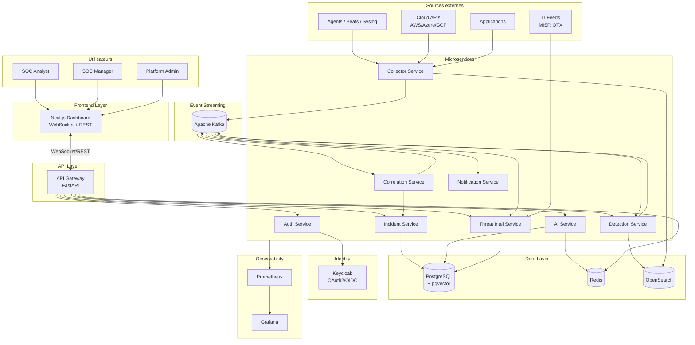
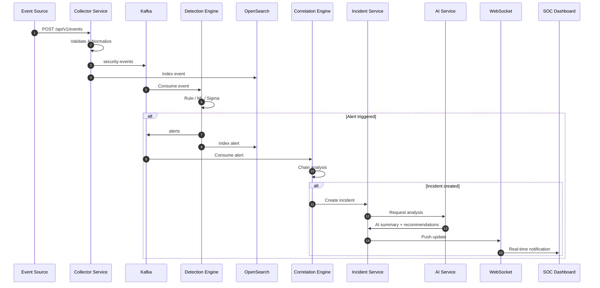
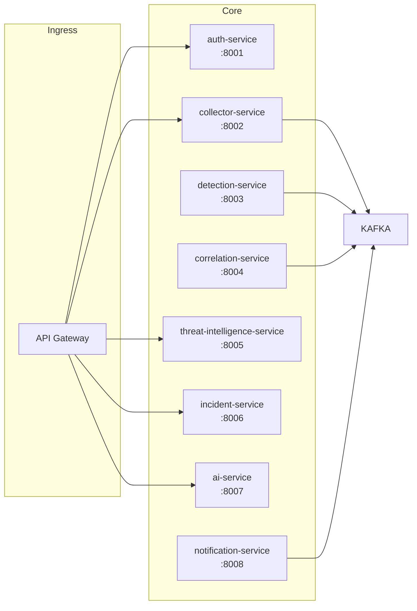
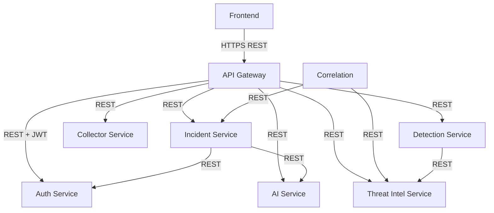
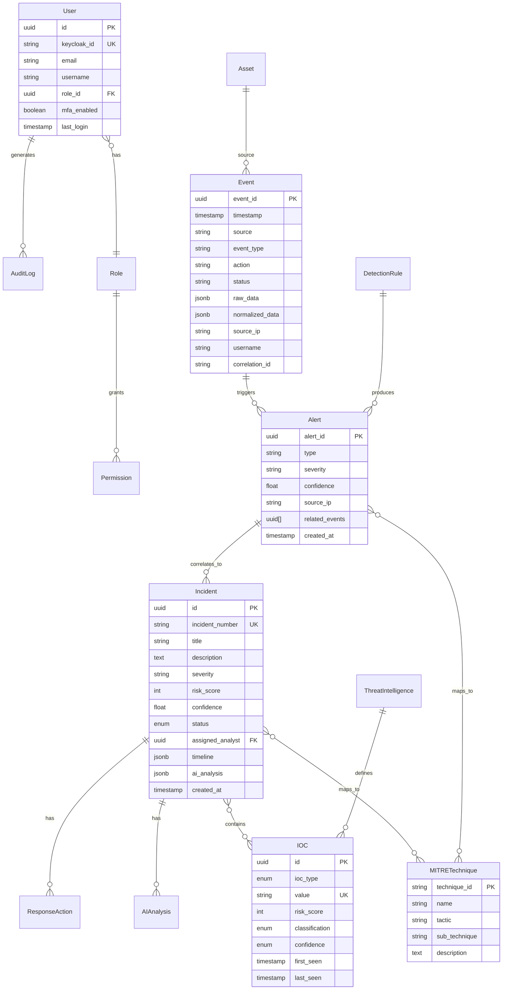
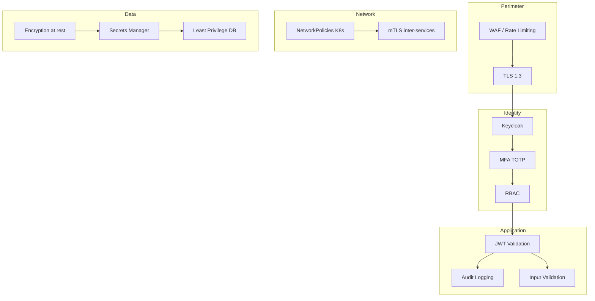
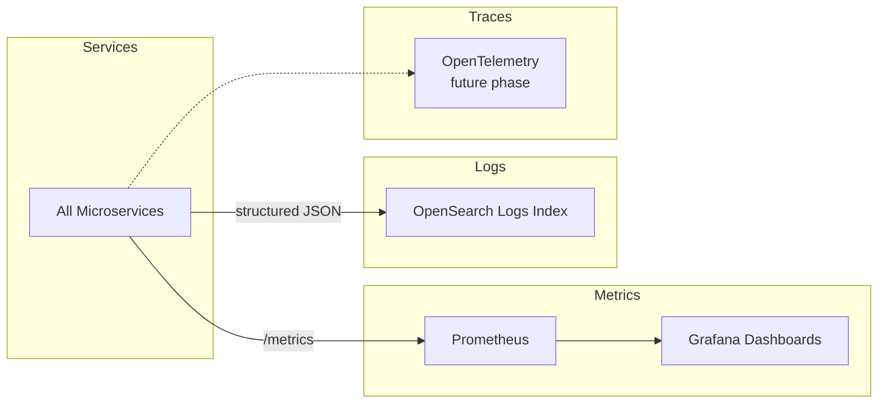

# AI SOC Platform — Architecture Overview

> **Phase 1** — Document d'architecture. Aucun code microservice à ce stade.

## Table des matières

1. [Vision et objectifs](#1-vision-et-objectifs)
2. [Architecture globale](#2-architecture-globale)
3. [Microservices](#3-microservices)
4. [Communications synchrones vs asynchrones](#4-communications)
5. [Modèle de données (aperçu)](#5-modèle-de-données)
6. [Sécurité](#6-sécurité)
7. [Observabilité](#7-observabilité)
8. [Documents associés](#8-documents-associés)

---

## 1. Vision et objectifs

AI SOC Platform vise à fournir une plateforme SOC **distribuée**, **event-driven**, **observable** et **sécurisée** capable de traiter des millions d'événements par jour tout en offrant une expérience analyste moderne avec assistance IA.

### Principes architecturaux

| Principe | Application |
|----------|-------------|
| **Event-driven** | Kafka comme backbone ; découplage producteur/consommateur |
| **Microservices** | Services indépendants, déployables et scalables séparément |
| **CQRS partiel** | Écriture via Kafka ; lecture via OpenSearch + PostgreSQL |
| **Defense in depth** | IAM, RBAC, MFA, NetworkPolicies, audit |
| **Fail-safe SOAR** | Actions de réponse simulées par défaut |
| **Observable by design** | Métriques Prometheus, logs structurés, traces |
| **AI-augmented** | RAG pour contexte ; ML pour anomalies |

---

## 2. Architecture globale

### Diagramme système (haut niveau)



### Flux de données principal



---

## 3. Microservices

### Vue d'ensemble des services



### Responsabilités par service

| Service | Port | Responsabilités | Base de données |
|---------|------|-----------------|-----------------|
| **api-gateway** | 8000 | Routing, rate limiting, auth validation, aggregation | Redis (cache, sessions) |
| **auth-service** | 8001 | Proxy IAM, permissions, audit auth, session mgmt | PostgreSQL |
| **collector-service** | 8002 | Ingestion, validation, normalisation, publication Kafka | OpenSearch (write) |
| **detection-service** | 8003 | Rules, Sigma, threshold, behavioral, ML anomaly | OpenSearch (read), Redis (state) |
| **correlation-service** | 8004 | Event chaining, incident auto-creation, timeline | PostgreSQL, OpenSearch |
| **threat-intelligence-service** | 8005 | IOC mgmt, reputation, TI feeds, enrichment | PostgreSQL |
| **incident-service** | 8006 | CRUD incidents, workflow, assignment, SOAR | PostgreSQL |
| **ai-service** | 8007 | RAG, LLM inference, embeddings, recommendations | PostgreSQL (pgvector) |
| **notification-service** | 8008 | Email, webhook, Slack/Discord alerts | PostgreSQL (delivery log) |

### Détail : Collector Service

```
Responsabilités :
├── POST /api/v1/events          → Ingestion multi-format
├── POST /api/v1/events/bulk     → Ingestion batch
├── Validation Pydantic
├── Normalisation ECS-like schema
├── Génération event_id (UUID v7)
├── Enrichissement metadata (received_at, source_type)
├── Publication Kafka (topic routing by event_type)
└── Indexation OpenSearch async
```

### Détail : Detection Engine

```
Modes de détection :
├── A. Rule-based (custom JSON rules)
├── B. Sigma rules (pySigma)
├── C. Threshold (sliding window, Redis)
├── D. Behavioral (baseline deviation)
└── E. Anomaly (Isolation Forest, scikit-learn)

Output :
├── Alert → Kafka topic "alerts"
├── Index OpenSearch "alerts"
└── Métriques Prometheus
```

### Détail : Correlation Engine

```
Stratégies :
├── Temporal correlation (time window)
├── Entity correlation (IP, user, host)
├── Attack chain templates (MITRE-based)
└── Graph-based event linking

Output :
├── Incident auto-creation
├── Risk score calculation
├── MITRE technique mapping
└── Timeline generation
```

---

## 4. Communications

### Synchrones (REST/gRPC)



| Appelant | Appelé | Endpoint | Usage |
|----------|--------|----------|-------|
| Frontend | API Gateway | `/api/v1/*` | Toutes les opérations UI |
| API Gateway | Auth Service | `/internal/validate-token` | Validation JWT |
| API Gateway | Auth Service | `/internal/permissions` | RBAC check |
| Correlation | Incident Service | `POST /internal/incidents` | Auto-création incident |
| Correlation | Threat Intel | `GET /internal/ioc/lookup` | Enrichissement IOC |
| Detection | Threat Intel | `GET /internal/reputation/{ip}` | IP reputation |
| Incident | AI Service | `POST /internal/analyze` | Analyse IA |
| Frontend | API Gateway | `WS /ws/alerts` | Temps réel |

### Asynchrones (Kafka)

Voir [Kafka Architecture](kafka-architecture.md) pour le détail complet.

| Topic | Producteurs | Consommateurs |
|-------|-------------|---------------|
| `security-events` | collector-service | detection, correlation, opensearch-indexer |
| `authentication-events` | collector-service | detection, correlation |
| `network-events` | collector-service | detection, correlation |
| `application-events` | collector-service | detection |
| `cloud-events` | collector-service | detection, correlation |
| `alerts` | detection-service | correlation, notification, opensearch-indexer |
| `incidents` | correlation-service, incident-service | notification, ai-service |
| `response-actions` | incident-service | notification, audit |

---

## 5. Modèle de données

Aperçu ERD — voir [Data Architecture](data-architecture.md) pour le schéma complet.



---

## 6. Sécurité

Voir [Threat Model](../security/threat-model.md) pour l'analyse STRIDE complète.

### Modèle de sécurité (résumé)



### Rôles RBAC

| Rôle | Permissions |
|------|-------------|
| **ADMIN** | Full platform access, user mgmt, config |
| **SOC_MANAGER** | Incidents, rules, reports, approve SOAR actions |
| **SOC_ANALYST** | View/create incidents, run AI, simulate SOAR |
| **VIEWER** | Read-only dashboard, events, incidents |

---

## 7. Observabilité



### Métriques clés

| Métrique | Type | Service |
|----------|------|---------|
| `api_requests_total` | Counter | api-gateway |
| `api_latency_seconds` | Histogram | api-gateway |
| `events_processed_total` | Counter | collector, detection |
| `events_per_second` | Gauge | collector |
| `alerts_created_total` | Counter | detection |
| `incidents_created_total` | Counter | correlation, incident |
| `detection_latency_seconds` | Histogram | detection |
| `ai_inference_time_seconds` | Histogram | ai-service |
| `kafka_consumer_lag` | Gauge | all consumers |

---

## 8. Documents associés

| Document | Contenu |
|----------|---------|
| [C4 Model](c4-model.md) | Context, Container, Component diagrams |
| [Data Architecture](data-architecture.md) | ERD complet, schémas JSON, index OpenSearch |
| [Kafka Architecture](kafka-architecture.md) | Topics, partitions, DLQ, idempotency |
| [AI/RAG Architecture](ai-rag-architecture.md) | Pipeline RAG, embeddings, LLM |
| [Technical Decisions](technical-decisions.md) | ADR-001 à ADR-010 |
| [Roadmap](roadmap.md) | 26 phases détaillées |
| [Threat Model](../security/threat-model.md) | STRIDE, mitigations |
| [Deployment](../deployment/deployment-overview.md) | Docker, K8s, AWS |
