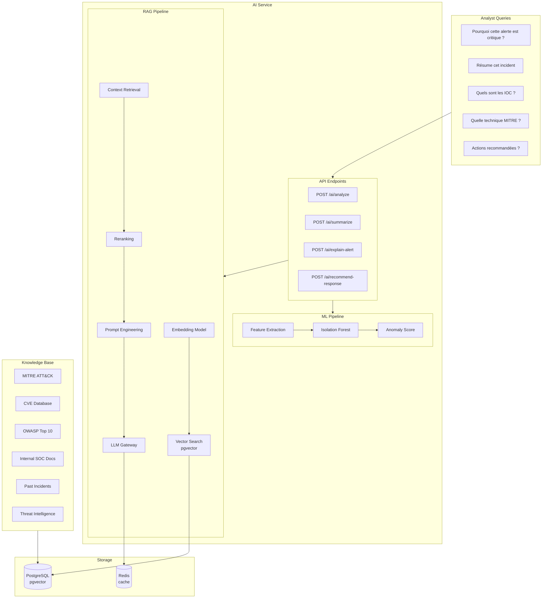
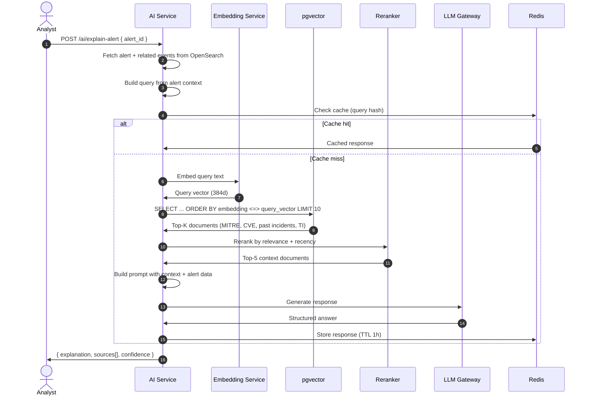
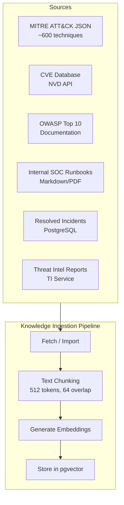
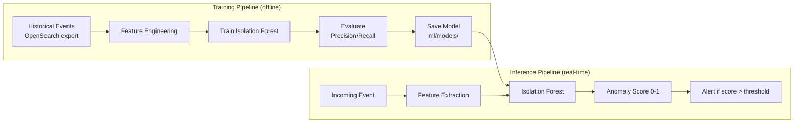

# AI / RAG Architecture — AI SOC Platform

## 1. Vue d'ensemble

Le module AI combine **Machine Learning** (détection d'anomalies) et **RAG** (Retrieval-Augmented Generation) pour fournir un assistant sécurité intelligent aux analystes SOC.



---

## 2. API Endpoints

| Endpoint | Method | Description | Input | Output |
|----------|--------|-------------|-------|--------|
| `/api/v1/ai/analyze` | POST | Analyse complète d'un incident/alert | `{ incident_id, context }` | `{ analysis, sources, confidence }` |
| `/api/v1/ai/summarize` | POST | Résumé exécutif | `{ incident_id }` | `{ summary, key_findings, sources }` |
| `/api/v1/ai/explain-alert` | POST | Explication d'une alerte | `{ alert_id }` | `{ explanation, severity_reasoning, mitre, sources }` |
| `/api/v1/ai/recommend-response` | POST | Actions recommandées | `{ incident_id }` | `{ actions[], rationale, sources }` |
| `/api/v1/ai/chat` | POST | Chat interactif (RAG) | `{ message, conversation_id }` | `{ response, sources[], conversation_id }` |
| `/api/v1/ai/anomaly-score` | POST | Score anomalie ML | `{ features }` | `{ anomaly_score, prediction, features_used }` |

---

## 3. RAG Pipeline

### Flux complet



### Embedding Model

| Paramètre | Valeur | Justification |
|-----------|--------|---------------|
| Model | `sentence-transformers/all-MiniLM-L6-v2` | Léger, 384 dims, bon rapport qualité/perf |
| Alternative prod | `BAAI/bge-small-en-v1.5` | Meilleure qualité, même dimension |
| Dimensions | 384 | Compromis storage/performance pgvector |
| Batch size | 32 | Indexation knowledge base |
| Device | CPU (dev) / GPU (prod optional) | |

### Vector Search (pgvector)

```sql
-- Recherche sémantique
SELECT
    id, title, content, doc_type, source_url,
    1 - (embedding <=> $1::vector) AS similarity
FROM knowledge_documents
WHERE doc_type = ANY($2::varchar[])
  AND 1 - (embedding <=> $1::vector) > 0.7
ORDER BY embedding <=> $1::vector
LIMIT 10;
```

Index : `ivfflat` avec `lists = 100` (ajuster selon volume).

---

## 4. Knowledge Base

### Sources de connaissances



### Document Types

| doc_type | Source | Update Frequency | Priority |
|----------|--------|-----------------|----------|
| `mitre` | MITRE ATT&CK STIX JSON | Monthly | High |
| `cve` | NVD API | Daily | Medium |
| `owasp` | OWASP documentation | Quarterly | Medium |
| `soc_doc` | Internal runbooks | On change | High |
| `incident` | Resolved incidents (auto) | On incident close | High |
| `ti` | Threat intel feeds | Daily | High |

### Chunking Strategy

```python
CHUNK_CONFIG = {
    "chunk_size": 512,        # tokens
    "chunk_overlap": 64,      # tokens
    "separators": ["\n## ", "\n### ", "\n\n", "\n", ". "],
    "metadata_preserved": ["doc_type", "source_url", "technique_id", "cve_id"]
}
```

---

## 5. Prompt Templates

### Explain Alert

```
You are a senior SOC analyst AI assistant. Explain the following security alert
to a SOC analyst. Use the provided context from the knowledge base.

## Alert
{alert_json}

## Related Events
{related_events_summary}

## Context from Knowledge Base
{retrieved_context}

## Instructions
- Explain WHY this alert was triggered
- Assess the severity and confidence
- Map to MITRE ATT&CK techniques if applicable
- Identify related IOCs
- Cite sources using [Source: {doc_type}/{title}] format

Respond in JSON:
{
  "explanation": "...",
  "severity_reasoning": "...",
  "mitre_techniques": [{"id": "T1110", "name": "...", " relevance": "..."}],
  "iocs_identified": [{"type": "ip", "value": "...", "classification": "..."}],
  "sources": [{"doc_type": "...", "title": "...", "relevance_score": 0.95}]
}
```

### Recommend Response

```
You are a SOC incident response advisor. Based on the incident data and
knowledge base context, recommend response actions.

IMPORTANT: All actions are SIMULATED by default. Never recommend destructive
actions without explicit approval workflow.

## Incident
{incident_json}

## Context
{retrieved_context}

Respond in JSON:
{
  "recommended_actions": [
    {
      "action": "BLOCK_IP",
      "priority": 1,
      "rationale": "...",
      "simulation_mode": true,
      "approval_required": true,
      "params": {"ip": "..."}
    }
  ],
  "investigation_steps": ["..."],
  "sources": [...]
}
```

---

## 6. Machine Learning — Anomaly Detection

### Architecture ML



### Features

| Feature | Type | Description |
|---------|------|-------------|
| `failed_login_count_5m` | int | Failed logins in 5 min window |
| `failed_login_count_1h` | int | Failed logins in 1 hour |
| `login_frequency` | float | Logins per hour (baseline deviation) |
| `unique_source_ips_1h` | int | Unique IPs connecting in 1 hour |
| `request_count_5m` | int | Total requests in 5 min |
| `traffic_volume_bytes_5m` | float | Network traffic volume |
| `connection_frequency` | float | Connections per minute |
| `unusual_login_hour` | bool | Login outside business hours (0-6, 22-24) |
| `privilege_escalation_count` | int | Priv esc events in window |
| `sensitive_file_access_count` | int | Sensitive file accesses |

### Model Configuration

```python
ISOLATION_FOREST_CONFIG = {
    "n_estimators": 200,
    "contamination": 0.01,       # Expected anomaly rate
    "max_samples": "auto",
    "random_state": 42,
    "anomaly_threshold": 0.75,   # Score above → alert
    "retrain_interval_days": 7,
    "min_training_samples": 10000
}
```

### Output

```json
{
  "anomaly_score": 0.87,
  "prediction": "anomaly",
  "is_anomaly": true,
  "features_used": {
    "failed_login_count_5m": 15,
    "unusual_login_hour": true,
    "unique_source_ips_1h": 3
  },
  "model_version": "isolation_forest_v1.2",
  "inference_time_ms": 12.5
}
```

### Roadmap ML

| Phase | Model | Status |
|-------|-------|--------|
| Phase 13 | Isolation Forest (scikit-learn) | Planned |
| Future | Random Forest (classification) | Backlog |
| Future | XGBoost (supervised) | Backlog |
| Future | Autoencoder (PyTorch, deep anomaly) | Backlog |

---

## 7. LLM Gateway

### Configuration

| Paramètre | Dev | Production |
|-----------|-----|------------|
| Provider | Ollama (local) | OpenAI API / Azure OpenAI / vLLM |
| Model | `llama3.1:8b` | `gpt-4o` / `claude-3.5-sonnet` |
| Max tokens | 2048 | 4096 |
| Temperature | 0.1 | 0.1 (deterministic for security) |
| Timeout | 30s | 60s |
| Rate limit | 10 req/min/user | 30 req/min/user |

### Abstraction Layer

```python
class LLMGateway(Protocol):
    async def generate(
        self,
        prompt: str,
        system_prompt: str,
        response_format: Literal["text", "json"] = "json",
        max_tokens: int = 2048,
        temperature: float = 0.1,
    ) -> LLMResponse: ...

class LLMResponse:
    content: str
    model: str
    tokens_used: int
    inference_time_ms: float
    finish_reason: str
```

Support multi-provider via adapter pattern :
- `OllamaAdapter` (dev/local)
- `OpenAIAdapter` (prod)
- `AzureOpenAIAdapter` (enterprise)

---

## 8. Response avec Sources

Chaque réponse IA inclut les sources utilisées :

```json
{
  "response": "This alert indicates a brute force attack (T1110)...",
  "confidence": 0.89,
  "sources": [
    {
      "doc_type": "mitre",
      "title": "T1110 - Brute Force",
      "excerpt": "Adversaries may use brute force techniques...",
      "relevance_score": 0.95,
      "source_url": "https://attack.mitre.org/techniques/T1110/"
    },
    {
      "doc_type": "incident",
      "title": "INC-2026-00038 - Similar brute force pattern",
      "excerpt": "Previous incident with same IP range...",
      "relevance_score": 0.82
    },
    {
      "doc_type": "soc_doc",
      "title": "Runbook: Brute Force Response",
      "excerpt": "1. Block source IP at firewall...",
      "relevance_score": 0.78
    }
  ],
  "inference_time_ms": 2340,
  "model_used": "gpt-4o",
  "tokens_used": 1850
}
```

---

## 9. Sécurité AI

| Risque | Mitigation |
|--------|------------|
| Prompt injection | Input sanitization, system prompt isolation, output validation |
| Hallucination | RAG grounding, source citation required, confidence scoring |
| Data leakage | Pas de données PII dans les prompts LLM externes sans anonymisation |
| Model poisoning | Models stockés dans S3 avec checksum, versioning |
| Rate abuse | Rate limiting par user, quota journalier |
| Cost control | Token budget par requête, cache Redis, modèle local en dev |

---

## 10. Métriques AI

| Métrique | Type | Description |
|----------|------|-------------|
| `ai_inference_time_seconds` | Histogram | Temps de réponse LLM |
| `ai_requests_total` | Counter | Requêtes par endpoint |
| `ai_rag_retrieval_time_seconds` | Histogram | Temps de recherche vectorielle |
| `ai_cache_hit_ratio` | Gauge | Taux de cache hit |
| `ai_anomaly_score` | Histogram | Distribution des scores ML |
| `ai_tokens_used_total` | Counter | Tokens consommés |
| `ai_errors_total` | Counter | Erreurs par type |
