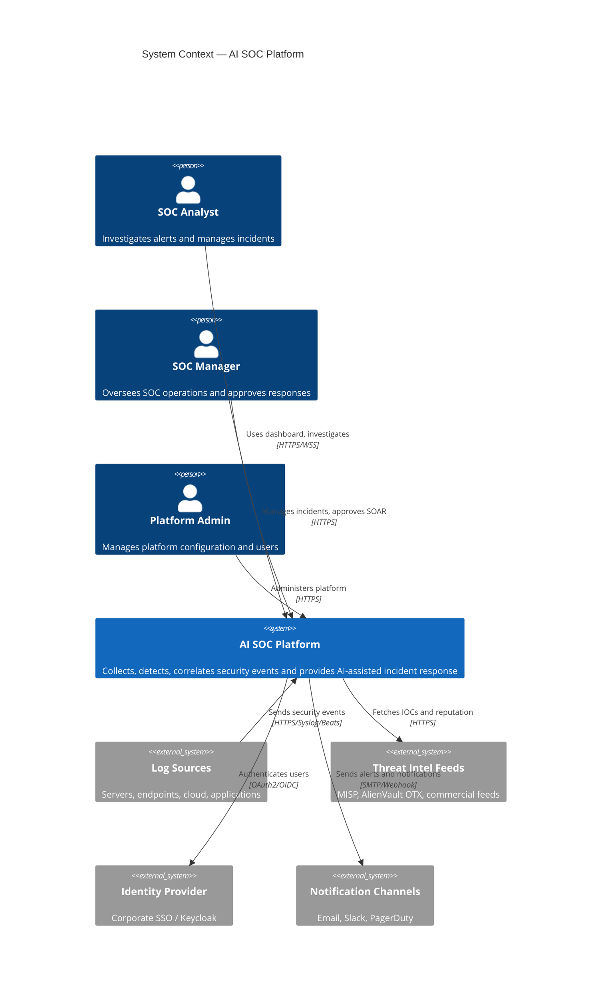
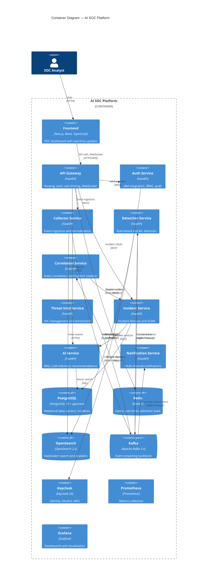
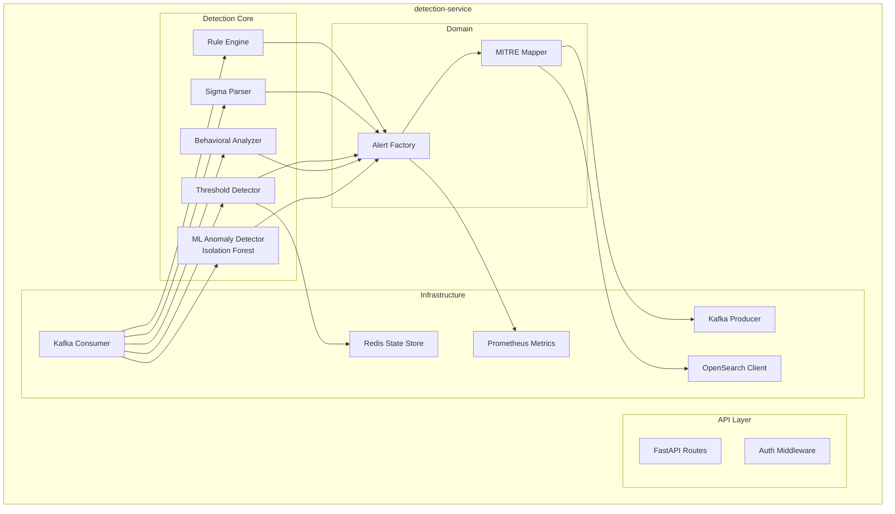
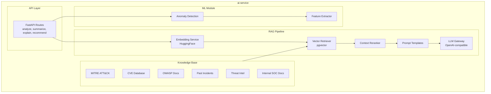
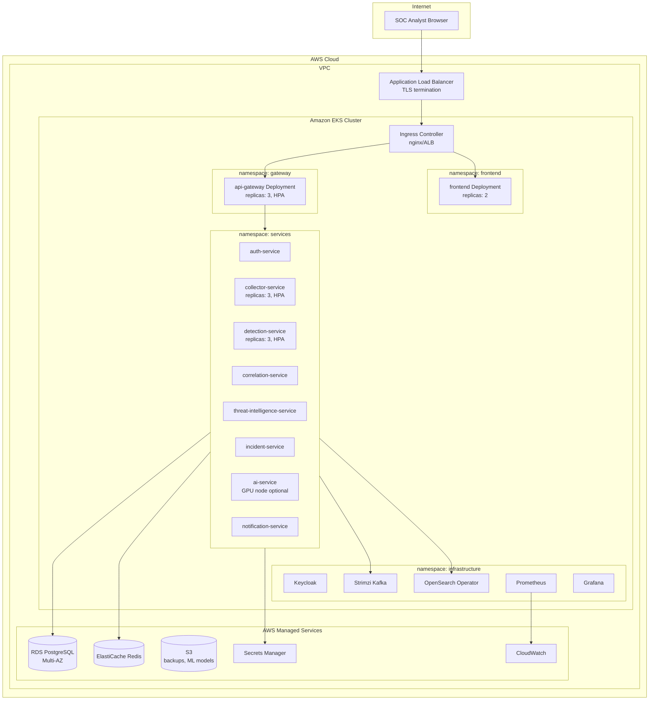
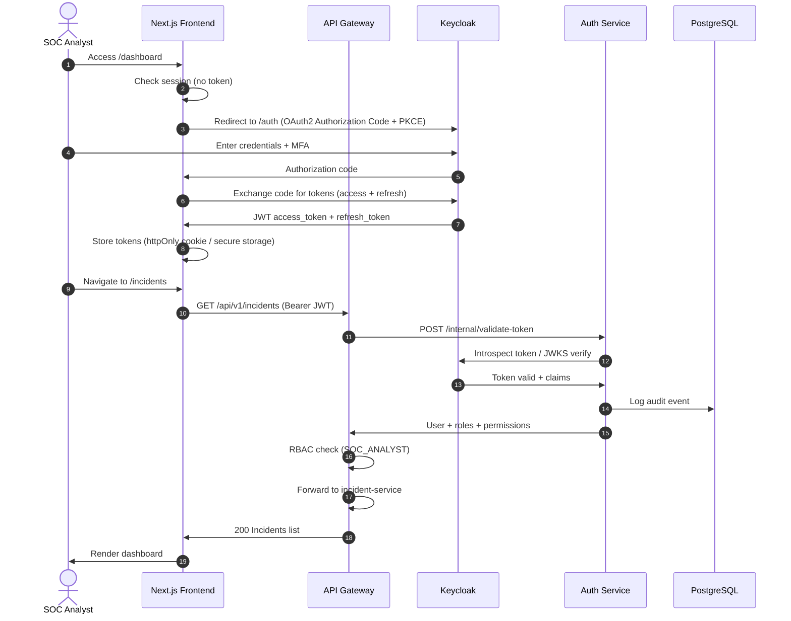
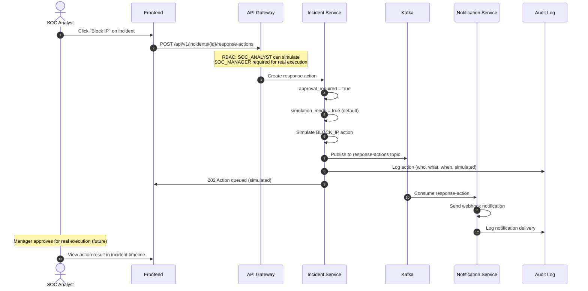

# C4 Model — AI SOC Platform

## Level 1 — System Context

## Level 2 — Container Diagram

## Level 3 — Component Diagram (Detection Service)

## Level 3 — Component Diagram (AI Service)

## Deployment Diagram

## Sequence Diagram — Authentication Flow

## Sequence Diagram — SOAR Response (Simulated)

