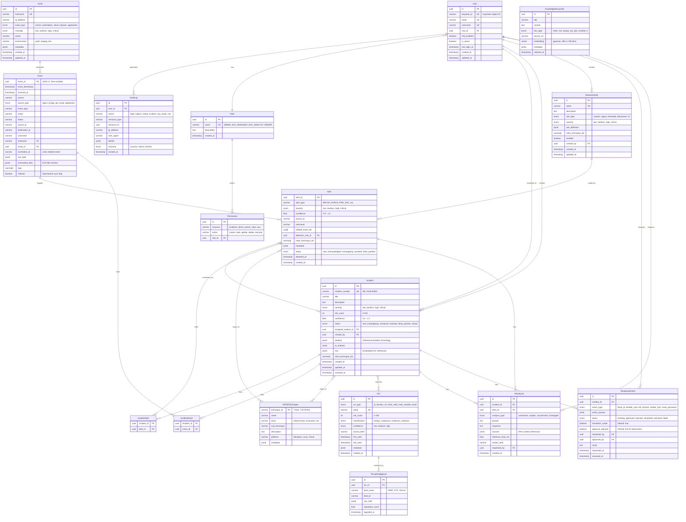

# Data Architecture — AI SOC Platform

## 1. Vue d'ensemble

La plateforme utilise une stratégie **polyglot persistence** :

| Store | Usage | Justification |
|-------|-------|---------------|
| **PostgreSQL** | Données relationnelles, incidents, users, IOC, audit | ACID, relations complexes |
| **pgvector** | Embeddings RAG, similarité sémantique | Recherche vectorielle native |
| **OpenSearch** | Events, alerts, logs, analytics | Full-text search, aggregations, time-series |
| **Redis** | Cache, rate limiting, detection state (sliding windows) | Latence sub-ms, TTL natif |
| **Kafka** | Event streaming, decoupling | Durabilité, replay, scale |

### Pattern CQRS partiel

```
WRITE PATH:  Collector → Kafka → Consumers → OpenSearch / PostgreSQL
READ PATH:   Dashboard → API Gateway → OpenSearch (events/alerts)
                              └──→ PostgreSQL (incidents, users, IOC)
```

---

## 2. Entity Relationship Diagram (complet)



---

## 3. Schéma PostgreSQL — DDL principal

```sql
-- Extensions
CREATE EXTENSION IF NOT EXISTS "uuid-ossp";
CREATE EXTENSION IF NOT EXISTS "pgvector";
CREATE EXTENSION IF NOT EXISTS "pg_trgm";

-- Enums
CREATE TYPE severity_level AS ENUM ('low', 'medium', 'high', 'critical');
CREATE TYPE incident_status AS ENUM ('new', 'investigating', 'contained', 'resolved', 'false_positive', 'closed');
CREATE TYPE ioc_type AS ENUM ('ip', 'domain', 'url', 'hash_md5', 'hash_sha256', 'email');
CREATE TYPE ioc_classification AS ENUM ('benign', 'suspicious', 'malicious', 'unknown');
CREATE TYPE asset_criticality AS ENUM ('low', 'medium', 'high', 'critical');
CREATE TYPE response_action_type AS ENUM ('block_ip', 'disable_user', 'kill_session', 'isolate_host', 'reset_password');
CREATE TYPE response_action_status AS ENUM ('pending', 'approved', 'rejected', 'simulated', 'executed', 'failed');

-- Roles & Permissions
CREATE TABLE roles (
    id UUID PRIMARY KEY DEFAULT uuid_generate_v4(),
    name VARCHAR(50) UNIQUE NOT NULL,
    description TEXT,
    created_at TIMESTAMPTZ DEFAULT NOW()
);

CREATE TABLE permissions (
    id UUID PRIMARY KEY DEFAULT uuid_generate_v4(),
    role_id UUID REFERENCES roles(id) ON DELETE CASCADE,
    resource VARCHAR(50) NOT NULL,
    action VARCHAR(50) NOT NULL,
    UNIQUE(role_id, resource, action)
);

-- Users (synced from Keycloak)
CREATE TABLE users (
    id UUID PRIMARY KEY DEFAULT uuid_generate_v4(),
    keycloak_id VARCHAR(255) UNIQUE NOT NULL,
    email VARCHAR(255) UNIQUE NOT NULL,
    username VARCHAR(100) UNIQUE NOT NULL,
    role_id UUID REFERENCES roles(id),
    mfa_enabled BOOLEAN DEFAULT FALSE,
    is_active BOOLEAN DEFAULT TRUE,
    last_login_at TIMESTAMPTZ,
    created_at TIMESTAMPTZ DEFAULT NOW(),
    updated_at TIMESTAMPTZ DEFAULT NOW()
);

-- Assets
CREATE TABLE assets (
    id UUID PRIMARY KEY DEFAULT uuid_generate_v4(),
    hostname VARCHAR(255) UNIQUE NOT NULL,
    ip_address INET,
    asset_type VARCHAR(50) NOT NULL,
    criticality asset_criticality DEFAULT 'medium',
    owner VARCHAR(255),
    environment VARCHAR(50) DEFAULT 'prod',
    metadata JSONB DEFAULT '{}',
    created_at TIMESTAMPTZ DEFAULT NOW(),
    updated_at TIMESTAMPTZ DEFAULT NOW()
);

-- Incidents
CREATE TABLE incidents (
    id UUID PRIMARY KEY DEFAULT uuid_generate_v4(),
    incident_number VARCHAR(20) UNIQUE NOT NULL,
    title VARCHAR(500) NOT NULL,
    description TEXT,
    severity severity_level NOT NULL,
    risk_score INTEGER CHECK (risk_score BETWEEN 0 AND 100),
    confidence REAL CHECK (confidence BETWEEN 0 AND 1),
    status incident_status DEFAULT 'new',
    assigned_analyst_id UUID REFERENCES users(id),
    created_by UUID REFERENCES users(id),
    timeline JSONB DEFAULT '[]',
    ai_analysis JSONB,
    iocs JSONB DEFAULT '[]',
    mitre_technique_ids VARCHAR(20)[] DEFAULT '{}',
    created_at TIMESTAMPTZ DEFAULT NOW(),
    updated_at TIMESTAMPTZ DEFAULT NOW(),
    resolved_at TIMESTAMPTZ
);

-- IOCs
CREATE TABLE iocs (
    id UUID PRIMARY KEY DEFAULT uuid_generate_v4(),
    ioc_type ioc_type NOT NULL,
    value VARCHAR(2048) NOT NULL,
    risk_score INTEGER CHECK (risk_score BETWEEN 0 AND 100),
    classification ioc_classification DEFAULT 'unknown',
    confidence VARCHAR(20) DEFAULT 'medium',
    source_feed VARCHAR(100),
    first_seen TIMESTAMPTZ,
    last_seen TIMESTAMPTZ,
    metadata JSONB DEFAULT '{}',
    created_at TIMESTAMPTZ DEFAULT NOW(),
    UNIQUE(ioc_type, value)
);

-- MITRE ATT&CK
CREATE TABLE mitre_techniques (
    technique_id VARCHAR(20) PRIMARY KEY,
    name VARCHAR(255) NOT NULL,
    tactic VARCHAR(100) NOT NULL,
    sub_technique VARCHAR(100),
    description TEXT,
    platform VARCHAR(100),
    metadata JSONB DEFAULT '{}'
);

-- Detection Rules
CREATE TABLE detection_rules (
    id UUID PRIMARY KEY DEFAULT uuid_generate_v4(),
    name VARCHAR(255) UNIQUE NOT NULL,
    description TEXT,
    rule_type VARCHAR(50) NOT NULL,
    severity severity_level NOT NULL,
    rule_definition JSONB NOT NULL,
    mitre_technique_ids VARCHAR(20)[] DEFAULT '{}',
    enabled BOOLEAN DEFAULT TRUE,
    created_by UUID REFERENCES users(id),
    created_at TIMESTAMPTZ DEFAULT NOW(),
    updated_at TIMESTAMPTZ DEFAULT NOW()
);

-- AI Analysis
CREATE TABLE ai_analyses (
    id UUID PRIMARY KEY DEFAULT uuid_generate_v4(),
    incident_id UUID REFERENCES incidents(id),
    alert_id UUID,
    analysis_type VARCHAR(50) NOT NULL,
    prompt TEXT,
    response TEXT NOT NULL,
    sources JSONB DEFAULT '[]',
    inference_time_ms REAL,
    model_used VARCHAR(100),
    requested_by UUID REFERENCES users(id),
    created_at TIMESTAMPTZ DEFAULT NOW()
);

-- Response Actions
CREATE TABLE response_actions (
    id UUID PRIMARY KEY DEFAULT uuid_generate_v4(),
    incident_id UUID REFERENCES incidents(id) NOT NULL,
    action_type response_action_type NOT NULL,
    action_params JSONB NOT NULL,
    status response_action_status DEFAULT 'pending',
    simulation_mode BOOLEAN DEFAULT TRUE,
    approval_required BOOLEAN DEFAULT TRUE,
    requested_by UUID REFERENCES users(id) NOT NULL,
    approved_by UUID REFERENCES users(id),
    result TEXT,
    requested_at TIMESTAMPTZ DEFAULT NOW(),
    executed_at TIMESTAMPTZ
);

-- Audit Logs (append-only)
CREATE TABLE audit_logs (
    id UUID PRIMARY KEY DEFAULT uuid_generate_v4(),
    user_id UUID REFERENCES users(id),
    action VARCHAR(100) NOT NULL,
    resource_type VARCHAR(50),
    resource_id UUID,
    ip_address INET,
    user_agent TEXT,
    details JSONB DEFAULT '{}',
    outcome VARCHAR(20) DEFAULT 'success',
    created_at TIMESTAMPTZ DEFAULT NOW()
);

-- Knowledge Base (RAG)
CREATE TABLE knowledge_documents (
    id UUID PRIMARY KEY DEFAULT uuid_generate_v4(),
    title VARCHAR(500) NOT NULL,
    content TEXT NOT NULL,
    doc_type VARCHAR(50) NOT NULL,
    source_url VARCHAR(2048),
    embedding vector(384),
    metadata JSONB DEFAULT '{}',
    indexed_at TIMESTAMPTZ DEFAULT NOW()
);

CREATE INDEX idx_knowledge_embedding ON knowledge_documents
    USING ivfflat (embedding vector_cosine_ops) WITH (lists = 100);

-- Indexes
CREATE INDEX idx_incidents_status ON incidents(status);
CREATE INDEX idx_incidents_severity ON incidents(severity);
CREATE INDEX idx_incidents_created ON incidents(created_at DESC);
CREATE INDEX idx_iocs_value ON iocs(value);
CREATE INDEX idx_iocs_type_value ON iocs(ioc_type, value);
CREATE INDEX idx_audit_logs_user ON audit_logs(user_id, created_at DESC);
CREATE INDEX idx_audit_logs_action ON audit_logs(action, created_at DESC);
```

---

## 4. OpenSearch — Index Mappings

### Index: `security-events`

```json
{
  "settings": {
    "number_of_shards": 3,
    "number_of_replicas": 1,
    "index.lifecycle.name": "security-events-policy",
    "index.lifecycle.rollover_alias": "security-events"
  },
  "mappings": {
    "properties": {
      "event_id": { "type": "keyword" },
      "event_timestamp": { "type": "date" },
      "received_at": { "type": "date" },
      "source": { "type": "keyword" },
      "source_type": { "type": "keyword" },
      "event_type": { "type": "keyword" },
      "action": { "type": "keyword" },
      "status": { "type": "keyword" },
      "source_ip": { "type": "ip" },
      "destination_ip": { "type": "ip" },
      "username": { "type": "keyword" },
      "hostname": { "type": "keyword" },
      "correlation_id": { "type": "keyword" },
      "raw_data": { "type": "object", "enabled": false },
      "normalized_data": { "type": "object" },
      "tags": { "type": "keyword" },
      "message": { "type": "text", "analyzer": "standard" }
    }
  }
}
```

### Index: `alerts`

```json
{
  "mappings": {
    "properties": {
      "alert_id": { "type": "keyword" },
      "alert_type": { "type": "keyword" },
      "severity": { "type": "keyword" },
      "confidence": { "type": "float" },
      "source_ip": { "type": "ip" },
      "username": { "type": "keyword" },
      "related_event_ids": { "type": "keyword" },
      "mitre_technique_ids": { "type": "keyword" },
      "status": { "type": "keyword" },
      "detected_at": { "type": "date" },
      "metadata": { "type": "object" }
    }
  }
}
```

### Index Lifecycle Policy

| Index | Retention hot | Retention warm | Retention cold | Delete |
|-------|--------------|----------------|----------------|--------|
| security-events | 7 days | 30 days | 90 days | 365 days |
| authentication-events | 7 days | 30 days | 90 days | 365 days |
| network-events | 7 days | 30 days | 90 days | 180 days |
| application-events | 7 days | 30 days | 60 days | 180 days |
| alerts | 30 days | 90 days | 365 days | 730 days |

---

## 5. Schéma d'événement normalisé (ECS-inspired)

```json
{
  "event_id": "0195a3b2-c4d5-7890-abcd-ef1234567890",
  "event_timestamp": "2026-08-18T00:45:32.123Z",
  "received_at": "2026-08-18T00:45:32.456Z",
  "correlation_id": "corr-0195a3b2-abc123",
  "source": "linux-server-01",
  "source_type": "agent",
  "event_type": "authentication",
  "action": "login_failed",
  "status": "failure",
  "source_ip": "192.168.1.10",
  "destination_ip": null,
  "username": "admin",
  "hostname": "linux-server-01",
  "asset_id": "uuid-asset-001",
  "tags": ["auth", "failed_login"],
  "normalized_data": {
    "event.category": ["authentication"],
    "event.type": ["start"],
    "event.outcome": "failure",
    "user.name": "admin",
    "source.ip": "192.168.1.10",
    "host.name": "linux-server-01",
    "log.level": "warning"
  },
  "raw_data": { }
}
```

---

## 6. Schéma Alert

```json
{
  "alert_id": "0195a3b2-alert-001",
  "alert_type": "BRUTE_FORCE",
  "severity": "high",
  "confidence": 0.92,
  "source_ip": "185.220.101.45",
  "username": "admin",
  "related_event_ids": ["evt-001", "evt-002", "..."],
  "detection_rule_id": "rule-brute-force-001",
  "mitre_technique_ids": ["T1110", "T1110.001"],
  "metadata": {
    "failed_attempts": 15,
    "time_window_minutes": 5,
    "detection_method": "threshold"
  },
  "status": "new",
  "detected_at": "2026-08-18T00:50:00.000Z"
}
```

---

## 7. Schéma Incident

```json
{
  "id": "uuid-incident-001",
  "incident_number": "INC-2026-00042",
  "title": "Suspected Account Compromise — admin@linux-server-01",
  "description": "Multiple failed logins followed by successful authentication and privilege escalation",
  "severity": "critical",
  "risk_score": 87,
  "confidence": 0.91,
  "status": "investigating",
  "assigned_analyst_id": "uuid-analyst-001",
  "timeline": [
    { "timestamp": "...", "type": "event", "id": "...", "summary": "15 failed login attempts" },
    { "timestamp": "...", "type": "event", "id": "...", "summary": "Successful login from 185.x.x.x" },
    { "timestamp": "...", "type": "alert", "id": "...", "summary": "BRUTE_FORCE detected" },
    { "timestamp": "...", "type": "alert", "id": "...", "summary": "PRIVILEGE_ESCALATION detected" }
  ],
  "iocs": [
    { "type": "ip", "value": "185.220.101.45", "classification": "malicious" }
  ],
  "mitre_technique_ids": ["T1110", "T1078", "T1548"],
  "ai_analysis": {
    "summary": "...",
    "recommended_actions": ["BLOCK_IP", "DISABLE_USER", "RESET_PASSWORD"],
    "confidence": 0.89
  },
  "related_events": ["evt-001", "evt-002"],
  "related_alerts": ["alert-001", "alert-002"],
  "response_actions": ["action-001"],
  "created_at": "2026-08-18T01:00:00.000Z",
  "updated_at": "2026-08-18T01:15:00.000Z"
}
```

---

## 8. Redis — Structures de données

| Key Pattern | Type | TTL | Usage |
|-------------|------|-----|-------|
| `rate:{ip}:{endpoint}` | String (counter) | 60s | Rate limiting |
| `session:{user_id}` | Hash | 3600s | Session cache |
| `detect:brute:{ip}` | Sorted Set | 300s | Failed login sliding window |
| `detect:threshold:{rule_id}:{entity}` | String | varies | Threshold counters |
| `ws:connections:{user_id}` | Set | - | WebSocket connection tracking |
| `cache:ti:{ioc_type}:{value}` | String (JSON) | 3600s | TI lookup cache |

---

## 9. Migrations Alembic

Chaque service possède son propre schéma PostgreSQL (schema-per-service) :

| Schema | Service | Tables |
|--------|---------|--------|
| `auth` | auth-service | users, roles, permissions, audit_logs |
| `incidents` | incident-service | incidents, response_actions |
| `ti` | threat-intelligence-service | iocs, threat_intelligence |
| `detection` | detection-service | detection_rules |
| `ai` | ai-service | ai_analyses, knowledge_documents |
| `shared` | - | mitre_techniques, assets |

Les migrations seront versionnées dans chaque service : `services/{service}/alembic/`.
