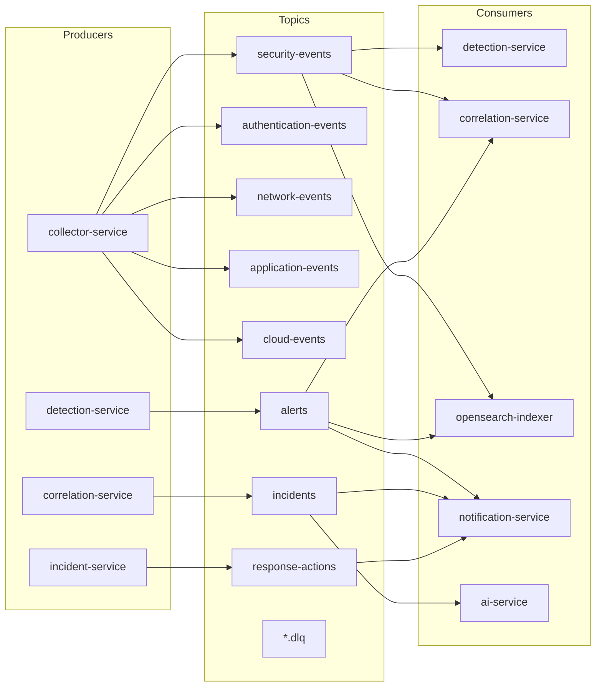
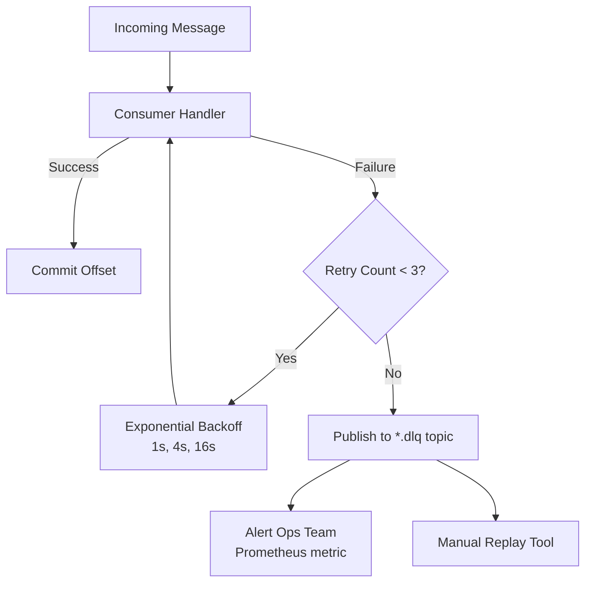
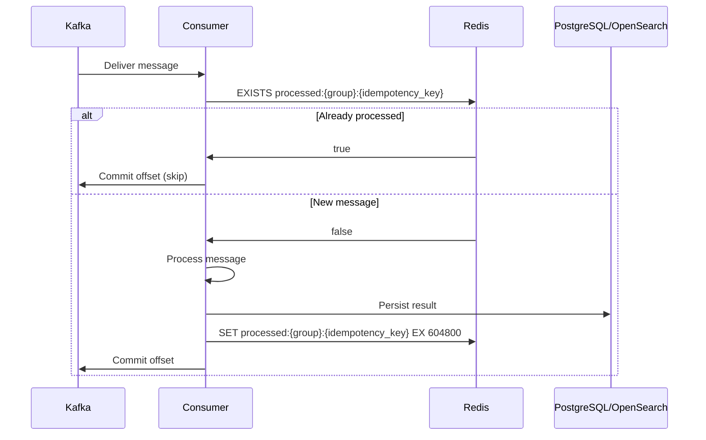
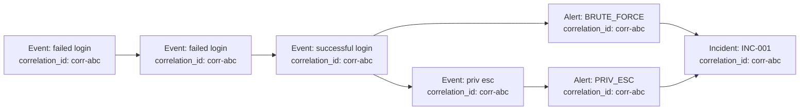

# Kafka Architecture — AI SOC Platform

## 1. Vue d'ensemble

Apache Kafka constitue le **backbone event-driven** de la plateforme. Tous les flux de données temps-réel transitent par Kafka, garantissant découplage, durabilité et capacité de replay.



---

## 2. Topics Kafka

### Configuration globale

| Paramètre | Valeur | Justification |
|-----------|--------|---------------|
| `replication.factor` | 3 (prod) / 1 (dev) | Haute disponibilité |
| `min.insync.replicas` | 2 (prod) / 1 (dev) | Durabilité |
| `retention.ms` | 7 jours (events) / 30 jours (alerts, incidents) | Replay + audit |
| `compression.type` | lz4 | Performance |
| `message.max.bytes` | 1048576 (1 MB) | Events volumineux |

### Détail des topics

| Topic | Partitions | Retention | Key | Producteur | Consommateurs |
|-------|-----------|-----------|-----|------------|---------------|
| `security-events` | 12 | 7d | `source` | collector-service | detection, correlation, opensearch-indexer |
| `authentication-events` | 6 | 7d | `source_ip` | collector-service | detection, correlation |
| `network-events` | 6 | 7d | `source_ip` | collector-service | detection, correlation |
| `application-events` | 6 | 7d | `source` | collector-service | detection |
| `cloud-events` | 6 | 7d | `source` | collector-service | detection, correlation |
| `alerts` | 6 | 30d | `alert_id` | detection-service | correlation, notification, opensearch-indexer |
| `incidents` | 3 | 30d | `incident_id` | correlation-service, incident-service | notification, ai-service |
| `response-actions` | 3 | 30d | `incident_id` | incident-service | notification, audit-indexer |
| `security-events.dlq` | 3 | 30d | - | (retry exhausted) | monitoring, manual replay |
| `alerts.dlq` | 3 | 30d | - | (retry exhausted) | monitoring, manual replay |

### Topic routing (Collector)

```python
TOPIC_ROUTING = {
    "authentication": "authentication-events",
    "network": "network-events",
    "application": "application-events",
    "cloud": "cloud-events",
    # default fallback
    "*": "security-events"
}
```

---

## 3. Message Envelope

Tous les messages Kafka utilisent un envelope standard :

```json
{
  "message_id": "0195a3b2-msg-001",
  "correlation_id": "corr-0195a3b2-abc123",
  "causation_id": "0195a3b2-msg-previous",
  "event_type": "SecurityEventCreated",
  "schema_version": "1.0",
  "timestamp": "2026-08-18T00:45:32.456Z",
  "source_service": "collector-service",
  "idempotency_key": "collector:evt-0195a3b2",
  "payload": {
    "event_id": "0195a3b2-c4d5-7890-abcd-ef1234567890",
    "event_timestamp": "2026-08-18T00:45:32.123Z",
    "source": "linux-server-01",
    "event_type": "authentication",
    "action": "login_failed",
    "status": "failure",
    "source_ip": "192.168.1.10",
    "username": "admin"
  },
  "metadata": {
    "trace_id": "trace-abc123",
    "partition_key": "linux-server-01"
  }
}
```

### Champs clés

| Champ | Usage |
|-------|-------|
| `message_id` | Identifiant unique du message (UUID v7) |
| `correlation_id` | Lie tous les messages d'une chaîne d'attaque |
| `causation_id` | Message parent direct (event → alert → incident) |
| `idempotency_key` | Déduplication côté consumer |
| `schema_version` | Évolution de schéma backward-compatible |

---

## 4. Consumer Groups

| Consumer Group | Service | Topics | Concurrency |
|----------------|---------|--------|-------------|
| `detection-security-events` | detection-service | security-events, authentication-events, network-events, application-events, cloud-events | 4 workers/topic |
| `correlation-alerts` | correlation-service | alerts | 2 workers |
| `correlation-events` | correlation-service | security-events, authentication-events | 2 workers |
| `opensearch-indexer-events` | opensearch-indexer (sidecar) | security-events, authentication-events, network-events, application-events | 3 workers |
| `opensearch-indexer-alerts` | opensearch-indexer (sidecar) | alerts | 2 workers |
| `notification-alerts` | notification-service | alerts, incidents | 2 workers |
| `notification-response` | notification-service | response-actions | 1 worker |
| `ai-incidents` | ai-service | incidents | 1 worker |

---

## 5. Retry & Dead Letter Queue (DLQ)



### Stratégie de retry

```python
RETRY_CONFIG = {
    "max_retries": 3,
    "backoff_base": 1.0,       # seconds
    "backoff_multiplier": 4,     # 1s → 4s → 16s
    "backoff_max": 60.0,         # cap at 60s
    "dlq_topic_suffix": ".dlq"
}
```

### DLQ Message Format

```json
{
  "original_topic": "security-events",
  "original_partition": 3,
  "original_offset": 12345,
  "original_message": { },
  "error": {
    "type": "ValidationError",
    "message": "Invalid event_type",
    "stack_trace": "..."
  },
  "retry_count": 3,
  "failed_at": "2026-08-18T01:00:00.000Z",
  "consumer_group": "detection-security-events"
}
```

---

## 6. Idempotency

### Côté Producer (Collector)

```
idempotency_key = f"{service}:{event_id}"
```

Le producer vérifie Redis avant publication :
```
SETNX idempotency:{key} 1 EX 86400
```

### Côté Consumer

Chaque consumer maintient un store d'idempotency dans Redis :

```
Key:   processed:{consumer_group}:{idempotency_key}
TTL:   7 days (aligné sur retention Kafka)
Check: EXISTS before processing
Set:   After successful processing
```



---

## 7. Event Correlation ID

Le `correlation_id` permet de tracer une chaîne d'attaque à travers tous les services :



### Génération du correlation_id

| Scénario | Règle |
|----------|-------|
| Nouvel événement sans lien | Générer `corr-{uuid_v7}` |
| Événement lié (même IP+user dans fenêtre 30min) | Réutiliser correlation_id existant (Redis lookup) |
| Alert dérivée d'events | Hériter correlation_id du premier event |
| Incident dérivé d'alerts | Hériter correlation_id de la première alert |

Redis lookup :
```
Key:   correlation:{entity_type}:{entity_value}
       e.g. correlation:ip:185.220.101.45
       e.g. correlation:user:admin
TTL:   1800s (30 minutes)
Value: corr-abc123
```

---

## 8. Monitoring Kafka

### Métriques Prometheus (via Kafka Exporter)

| Métrique | Description | Alert Threshold |
|----------|-------------|-----------------|
| `kafka_consumer_lag` | Lag par consumer group/topic | > 10000 messages |
| `kafka_topic_partition_current_offset` | Offset actuel | - |
| `kafka_consumergroup_members` | Membres actifs du group | < expected replicas |
| `kafka_server_brokertopicmetrics_messagesin_total` | Messages entrants/sec | - |
| `dlq_messages_total` | Messages en DLQ | > 0 (warning) |

### Health Checks

Chaque service consumer expose :
```
GET /health/kafka
{
  "status": "healthy",
  "consumer_groups": [
    {
      "group": "detection-security-events",
      "topics": ["security-events"],
      "lag": 42,
      "status": "healthy"
    }
  ]
}
```

---

## 9. Schema Evolution

Utilisation de **JSON Schema** avec versioning backward-compatible :

```
schemas/
├── security-event/v1.json
├── security-event/v2.json
├── alert/v1.json
├── incident/v1.json
└── response-action/v1.json
```

Règles :
- Ajout de champs optionnels : OK (minor version)
- Suppression de champs : NON (breaking change → new topic ou version majeure)
- Les consumers ignorent les champs inconnus
- `schema_version` dans l'envelope permet le routing

---

## 10. Configuration Dev vs Prod

| Paramètre | Development (Docker Compose) | Production (Strimzi on EKS) |
|-----------|------------------------------|----------------------------|
| Brokers | 1 (KRaft mode) | 3 |
| Replication | 1 | 3 |
| Partitions | 3 (all topics) | Voir table section 2 |
| Retention | 1 day | 7-30 days |
| Compression | none | lz4 |
| Security | PLAINTEXT | SASL_SSL + ACLs |
| UI | Kafka UI (Provectus) | Strimzi Dashboard |
