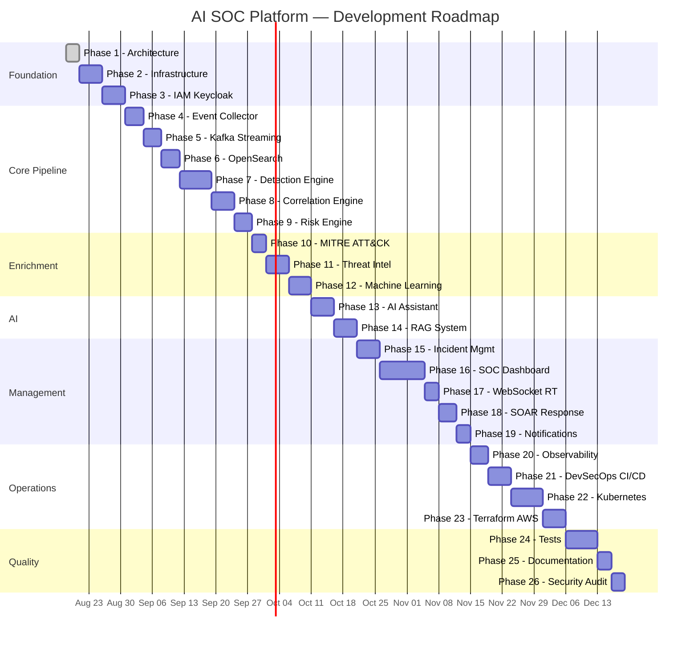

# Roadmap — AI SOC Platform

> Plan de développement en 26 phases. Chaque phase est autonome, testable et validable.

---

## Vue d'ensemble



---

## Phase 1 — Architecture ✅

**Objectif** : Définir l'architecture complète avant tout code.

**Livrables** :
- [x] Architecture globale et microservices
- [x] C4 Model (Context, Container, Component, Deployment)
- [x] Data Architecture (ERD, schemas, OpenSearch mappings)
- [x] Kafka Architecture (topics, consumers, DLQ, idempotency)
- [x] AI/RAG Architecture
- [x] Threat Model (STRIDE)
- [x] Technical Decisions (ADR-001 à ADR-015)
- [x] Roadmap détaillée
- [x] Repository structure

**Validation** :
- [ ] Architecture review par l'équipe
- [ ] Diagrammes Mermaid render correctly
- [ ] Tous les microservices documentés
- [ ] Threat model couvre les scénarios principaux

---

## Phase 2 — Infrastructure Locale

**Objectif** : Docker Compose fonctionnel pour tout le stack infra.

**Livrables** :
- `docker-compose.yml` (PostgreSQL, Redis, Kafka, OpenSearch, Keycloak, Prometheus, Grafana)
- `Makefile` (up, down, logs, test, lint, format)
- `.env.example`
- Health checks pour chaque service
- Volumes persistants
- Networks isolés

**Commandes cibles** :
```bash
cp .env.example .env
make up        # Tout démarre
make down      # Tout s'arrête
make logs      # Logs agrégés
make ps        # Status des services
```

**Validation** :
- [ ] `make up` démarre tous les services sans erreur
- [ ] PostgreSQL accessible (port 5432)
- [ ] Redis accessible (port 6379)
- [ ] Kafka accessible (port 9092)
- [ ] OpenSearch accessible (port 9200)
- [ ] Keycloak accessible (port 8080)
- [ ] Prometheus accessible (port 9090)
- [ ] Grafana accessible (port 3001)
- [ ] Kafka UI accessible (port 8085)

---

## Phase 3 — IAM (Keycloak)

**Objectif** : Authentification et autorisation complètes.

**Livrables** :
- Keycloak realm `ai-soc` configuré
- Rôles : ADMIN, SOC_MANAGER, SOC_ANALYST, VIEWER
- MFA TOTP activé
- auth-service (FastAPI) : token validation, RBAC, audit
- api-gateway : auth middleware
- Migrations Alembic (users, roles, permissions, audit_logs)

**Validation** :
- [ ] Login via Keycloak fonctionne
- [ ] JWT access + refresh token
- [ ] MFA enrollment et vérification
- [ ] RBAC : VIEWER ne peut pas créer d'incident
- [ ] Audit log enregistre login/logout
- [ ] Token expiration et refresh

---

## Phase 4 — Event Collector

**Objectif** : Ingestion et normalisation d'événements.

**Livrables** :
- collector-service (FastAPI)
- `POST /api/v1/events` et `POST /api/v1/events/bulk`
- Validation Pydantic
- Normalisation ECS-inspired
- Publication Kafka
- Tests unitaires et API

**Validation** :
- [ ] POST event valide → 202 Accepted
- [ ] POST event invalide → 422 Validation Error
- [ ] Event normalisé publié dans Kafka
- [ ] event_id UUID v7 généré
- [ ] Bulk ingestion (100 events)

---

## Phase 5 — Kafka Streaming

**Objectif** : Topics, producers, consumers, DLQ, idempotency.

**Livrables** :
- Topic creation script
- Shared Kafka library (`libs/kafka/`)
- Producer avec envelope standard
- Consumer base class avec retry/DLQ
- Idempotency (Redis)
- Correlation ID propagation

**Validation** :
- [ ] 8 topics créés
- [ ] Producer publie avec envelope
- [ ] Consumer consomme et commit
- [ ] Retry 3x puis DLQ
- [ ] Idempotency : duplicate message ignoré
- [ ] correlation_id propagé

---

## Phase 6 — OpenSearch

**Objectif** : Indexation et recherche d'events/alerts.

**Livrables** :
- Index templates (security-events, alerts, etc.)
- opensearch-indexer (Kafka consumer → OpenSearch)
- Search API (full-text, filters, aggregations, time range)
- Index Lifecycle Management

**Validation** :
- [ ] Events indexés automatiquement depuis Kafka
- [ ] Full-text search fonctionne
- [ ] Aggregations (count by severity, timeline)
- [ ] Time range queries
- [ ] ILM policy appliquée

---

## Phase 7 — Detection Engine

**Objectif** : Moteur de détection multi-modes.

**Livrables** :
- detection-service
- Rule-based engine
- Sigma parser (pySigma)
- Threshold detector (Redis sliding window)
- Behavioral analyzer
- ML anomaly detector (Isolation Forest)
- Alert generation → Kafka

**Validation** :
- [ ] 10 failed logins in 5 min → BRUTE_FORCE alert
- [ ] Sigma rule exécutée correctement
- [ ] Threshold detection fonctionne
- [ ] ML anomaly score calculé
- [ ] Alert publiée dans Kafka topic `alerts`
- [ ] MITRE technique mappée

---

## Phase 8 — Correlation Engine

**Objectif** : Corréler events/alerts en incidents.

**Livrables** :
- correlation-service
- Temporal correlation
- Entity correlation (IP, user, host)
- Attack chain templates
- Auto-incident creation
- Timeline generation

**Validation** :
- [ ] 5 events corrélés → 1 incident
- [ ] Timeline chronologique correcte
- [ ] Attack chain identifiée
- [ ] Incident publié dans Kafka

---

## Phase 9 — Risk Engine

**Objectif** : Calcul de risk score 0-100.

**Livrables** :
- Risk scoring module
- Facteurs : severity, IP reputation, frequency, user risk, asset criticality, behavioral anomaly, MITRE, TI
- Score categories : LOW (0-20), MEDIUM (21-40), HIGH (41-70), CRITICAL (71-100)

**Validation** :
- [ ] Risk score calculé pour chaque incident
- [ ] Facteurs pondérés correctement
- [ ] Catégorie de risque correcte
- [ ] Score mis à jour dynamiquement

---

## Phase 10 — MITRE ATT&CK

**Objectif** : Intégration MITRE ATT&CK framework.

**Livrables** :
- Import MITRE ATT&CK JSON (STIX)
- Table mitre_techniques populated
- Mapping automatique detection → technique
- API : GET /api/v1/mitre/techniques

**Validation** :
- [ ] ~600 techniques importées
- [ ] BRUTE_FORCE → T1110
- [ ] PRIV_ESC → T1548
- [ ] API retourne techniques avec filtres

---

## Phase 11 — Threat Intelligence

**Objectif** : Gestion IOC et réputation.

**Livrables** :
- threat-intelligence-service
- IOC CRUD (IP, domain, URL, hash, email)
- Reputation scoring
- TI feed ingestion (manual + API)
- Enrichment API pour autres services

**Validation** :
- [ ] IOC IP créé avec risk score
- [ ] Lookup IP → classification MALICIOUS
- [ ] Enrichment automatique sur events
- [ ] Cache Redis pour lookups

---

## Phase 12 — Machine Learning

**Objectif** : Anomaly detection avec Isolation Forest.

**Livrables** :
- Feature extraction pipeline
- Training script (historical data)
- Inference endpoint
- Model versioning (ml/models/)
- Integration avec detection-service

**Validation** :
- [ ] Model entraîné sur dataset
- [ ] anomaly_score retourné (0-1)
- [ ] Prediction anomaly/normal
- [ ] Inference < 50ms
- [ ] Integration detection → alert si anomalie

---

## Phase 13 — AI Security Assistant

**Objectif** : Endpoints IA pour analystes.

**Livrables** :
- ai-service
- POST /ai/analyze, /ai/summarize, /ai/explain-alert, /ai/recommend-response
- LLM Gateway (Ollama dev)
- Prompt templates

**Validation** :
- [ ] Explain alert retourne explication structurée
- [ ] Summarize incident retourne résumé
- [ ] Recommend response retourne actions
- [ ] Réponses en JSON structuré

---

## Phase 14 — RAG System

**Objectif** : Retrieval-Augmented Generation avec pgvector.

**Livrables** :
- Knowledge base ingestion pipeline
- Embedding service (HuggingFace)
- Vector search (pgvector)
- Context retrieval + reranking
- Sources citées dans les réponses

**Validation** :
- [ ] MITRE, CVE, OWASP indexés
- [ ] Vector search retourne documents pertinents
- [ ] Réponse IA inclut sources
- [ ] Chat interactif fonctionne

---

## Phase 15 — Incident Management

**Objectif** : CRUD incidents complet.

**Livrables** :
- incident-service
- POST/GET/PATCH /incidents
- Status workflow (NEW → INVESTIGATING → CONTAINED → RESOLVED → CLOSED)
- Assignment, timeline, related events/alerts

**Validation** :
- [ ] CRUD complet
- [ ] Status transitions validées
- [ ] Assignment analyste
- [ ] Timeline auto-générée

---

## Phase 16 — SOC Dashboard (Next.js)

**Objectif** : Interface SOC professionnelle.

**Livrables** :
- Next.js app avec toutes les pages
- Dashboard avec KPIs et graphiques (Recharts)
- Pages : events, alerts, incidents, TI, MITRE, AI assistant
- shadcn/ui components
- TanStack Query data fetching
- Responsive design

**Validation** :
- [ ] Dashboard affiche KPIs
- [ ] Graphiques interactifs
- [ ] Navigation entre pages
- [ ] Auth protection (redirect login)
- [ ] Responsive mobile/tablet

---

## Phase 17 — WebSocket Real-Time

**Objectif** : Mises à jour temps réel du dashboard.

**Livrables** :
- WebSocket endpoint sur API Gateway
- Kafka → Gateway → WebSocket push
- Frontend WebSocket client
- Auto-update alerts/incidents

**Validation** :
- [ ] Nouvelle alerte apparaît sans refresh
- [ ] Nouvel incident notifié en temps réel
- [ ] Reconnection automatique
- [ ] Auth JWT sur WebSocket handshake

---

## Phase 18 — SOAR Response

**Objectif** : Actions de réponse simulées.

**Livrables** :
- Response action types (BLOCK_IP, DISABLE_USER, etc.)
- simulation_mode=true par défaut
- approval_required workflow
- Audit logging

**Validation** :
- [ ] Action simulée retournée
- [ ] Approval workflow fonctionne
- [ ] Audit log enregistré
- [ ] RBAC enforced

---

## Phase 19 — Notifications

**Objectif** : Alertes multi-canal.

**Livrables** :
- notification-service
- Email (SMTP)
- Webhook
- Slack/Discord (optionnel)
- CRITICAL alert → notification immédiate

**Validation** :
- [ ] Email envoyé pour alert CRITICAL
- [ ] Webhook POST fonctionne
- [ ] Delivery log enregistré

---

## Phase 20 — Observability

**Objectif** : Métriques Prometheus + dashboards Grafana.

**Livrables** :
- Prometheus metrics dans chaque service
- Grafana dashboards (API, Kafka, Detection, AI, Infra)
- Alerting rules

**Validation** :
- [ ] /metrics endpoint sur chaque service
- [ ] Grafana dashboards affichent data
- [ ] Alerting rules configurées

---

## Phase 21 — DevSecOps CI/CD

**Objectif** : Pipeline GitHub Actions complet.

**Livrables** :
- `.github/workflows/ci.yml`
- Lint (ruff, eslint)
- Unit tests (pytest, jest)
- SAST (Semgrep)
- Secret scan (Gitleaks)
- Container scan (Trivy)
- Integration tests
- DAST (OWASP ZAP)

**Validation** :
- [ ] Pipeline passe on push
- [ ] Semgrep détecte vulnérabilités
- [ ] Trivy scan image
- [ ] Gitleaks scan secrets

---

## Phase 22 — Kubernetes

**Objectif** : Manifests K8s + Helm Chart.

**Livrables** :
- Deployments, Services, ConfigMaps, Secrets
- Ingress, HPA, NetworkPolicies, PVs
- Helm Chart
- ArgoCD Application

**Validation** :
- [ ] `helm install` déploie la plateforme
- [ ] HPA scale under load
- [ ] NetworkPolicies restrict traffic
- [ ] Health checks pass

---

## Phase 23 — Terraform / AWS

**Objectif** : Infrastructure AWS as Code.

**Livrables** :
- VPC, EKS, RDS, ElastiCache, S3, IAM, ALB
- Variables Terraform (no hardcoded secrets)
- Environments (dev, staging, prod)

**Validation** :
- [ ] `terraform plan` sans erreur
- [ ] Pas de secrets hardcodés
- [ ] Modules réutilisables

---

## Phase 24 — Tests

**Objectif** : Couverture de tests complète.

**Livrables** :
- Unit tests (pytest, >80% coverage backend)
- Integration tests (Kafka, OpenSearch, PostgreSQL)
- API tests
- E2E tests (Playwright)
- Security tests
- Scénario de démonstration complet

**Validation** :
- [ ] Scénario demo complet (20 failed logins → incident → AI analysis → SOAR)
- [ ] E2E Playwright passe
- [ ] Coverage > 80%

---

## Phase 25 — Documentation

**Objectif** : Documentation professionnelle complète.

**Livrables** :
- README final
- docs/architecture/, docs/security/, docs/deployment/, docs/api/
- OpenAPI specs
- Contributing guide

---

## Phase 26 — Security Audit Final

**Objectif** : Audit de sécurité complet.

**Livrables** :
- Semgrep full scan
- Trivy full scan
- OWASP ZAP full scan
- Threat model review
- Security checklist validation
- Penetration test report (manual)

**Validation** :
- [ ] 0 critical/high vulnerabilities
- [ ] Threat model mitigations verified
- [ ] Security checklist 100%

---

## Scénario de Démonstration Final

```
20 failed login attempts (185.x.x.x → admin)
        ↓
Successful login from same IP
        ↓
Privilege escalation (sudo su)
        ↓
Suspicious command (curl malicious URL)
        ↓
Sensitive file access (/etc/shadow)
        ↓
Outbound network connection (C2)

Platform response:
1.  ✅ Events ingested via collector
2.  ✅ Published to Kafka
3.  ✅ Indexed in OpenSearch
4.  ✅ BRUTE_FORCE alert generated
5.  ✅ PRIV_ESC alert generated
6.  ✅ Events correlated → Incident INC-2026-00001
7.  ✅ Risk score: 87/100 (CRITICAL)
8.  ✅ MITRE: T1110, T1078, T1548, T1003
9.  ✅ TI enrichment: IP 185.x.x.x MALICIOUS
10. ✅ AI analysis generated
11. ✅ Dashboard updated (WebSocket)
12. ✅ SOAR: BLOCK_IP recommended (simulated)
13. ✅ Notification sent (CRITICAL)
14. ✅ Audit log complete
```
