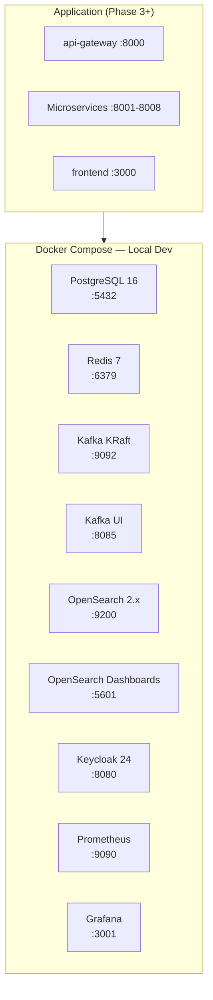
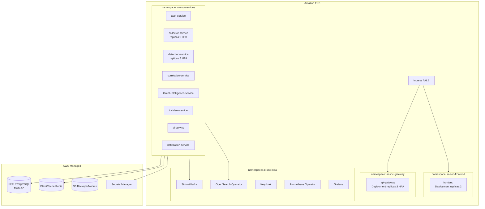
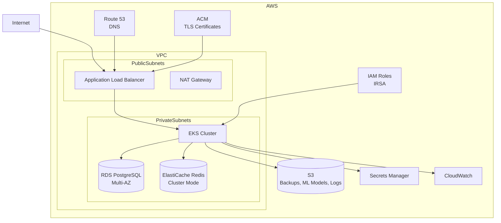

# Deployment Overview — AI SOC Platform

## Environments

| Environment | Purpose | Infrastructure |
|-------------|---------|----------------|
| **local** | Development | Docker Compose |
| **staging** | Pre-production testing | EKS (minimal) |
| **production** | Production SOC | EKS (HA) + AWS managed services |

---

## Local Development (Docker Compose)



**Commandes** :
```bash
cp .env.example .env
make up          # Start infrastructure
make up-all      # Start infra + app services (Phase 3+)
make down        # Stop everything
make logs        # Tail logs
make ps          # Service status
```

---

## Kubernetes (Production)



**Deploy** :
```bash
# Via Helm
helm install ai-soc ./infrastructure/helm/ai-soc-platform \
  --namespace ai-soc \
  --values infrastructure/helm/values-production.yaml

# Via ArgoCD (GitOps)
kubectl apply -f infrastructure/kubernetes/argocd/application.yaml
```

---

## AWS Architecture (Terraform)



**Terraform** :
```bash
cd infrastructure/terraform/environments/staging
terraform init
terraform plan -var-file=terraform.tfvars
terraform apply -var-file=terraform.tfvars
```

---

## Port Mapping (Local Dev)

| Service | Port | URL |
|---------|------|-----|
| Frontend | 3000 | http://localhost:3000 |
| API Gateway | 8000 | http://localhost:8000 |
| Auth Service | 8001 | http://localhost:8001 |
| Collector Service | 8002 | http://localhost:8002 |
| Detection Service | 8003 | http://localhost:8003 |
| Correlation Service | 8004 | http://localhost:8004 |
| Threat Intel Service | 8005 | http://localhost:8005 |
| Incident Service | 8006 | http://localhost:8006 |
| AI Service | 8007 | http://localhost:8007 |
| Notification Service | 8008 | http://localhost:8008 |
| Keycloak | 8080 | http://localhost:8080 |
| Kafka UI | 8085 | http://localhost:8085 |
| PostgreSQL | 5432 | localhost:5432 |
| Redis | 6379 | localhost:6379 |
| Kafka | 9092 | localhost:9092 |
| OpenSearch | 9200 | http://localhost:9200 |
| OpenSearch Dashboards | 5601 | http://localhost:5601 |
| Prometheus | 9090 | http://localhost:9090 |
| Grafana | 3001 | http://localhost:3001 |

---

## Resource Requirements

### Local Development (minimum)

| Resource | Minimum |
|----------|---------|
| CPU | 4 cores |
| RAM | 16 GB |
| Disk | 30 GB |

### Production (EKS)

| Component | Spec |
|-----------|------|
| EKS Nodes | 3x m5.xlarge (4 vCPU, 16 GB) |
| RDS PostgreSQL | db.r6g.large, Multi-AZ |
| ElastiCache Redis | cache.r6g.large, 2 nodes |
| OpenSearch | 3x r6g.large.search |
| Kafka (Strimzi) | 3 brokers, 3x m5.large |

---

## CI/CD Pipeline

```mermaid
flowchart LR
    PUSH[git push] --> LINT[Lint<br/>ruff + eslint]
    LINT --> TEST[Unit Tests<br/>pytest + jest]
    TEST --> SAST[SAST<br/>Semgrep]
    SAST --> DEPS[Dependency Scan<br/>pip-audit + npm audit]
    DEPS --> SECRETS[Secret Scan<br/>Gitleaks]
    SECRETS --> BUILD[Build Docker Images]
    BUILD --> TRIVY[Container Scan<br/>Trivy]
    TRIVY --> INT[Integration Tests]
    INT --> DAST[DAST<br/>OWASP ZAP]
    DAST --> PUSH_REG[Push to Registry]
    PUSH_REG --> DEPLOY[Deploy<br/>ArgoCD]
```



---

## Secrets Management

| Secret | Local (.env) | Production |
|--------|-------------|------------|
| PostgreSQL password | `.env` | AWS Secrets Manager |
| Redis password | `.env` | AWS Secrets Manager |
| Keycloak admin | `.env` | AWS Secrets Manager |
| JWT secret | `.env` | AWS Secrets Manager |
| LLM API key | `.env` | AWS Secrets Manager |
| Kafka credentials | `.env` | K8s Secrets (Sealed) |
| AWS credentials | Never in code | IAM Roles (IRSA) |

**Rule** : Never hardcode secrets. Never commit `.env` to Git.
