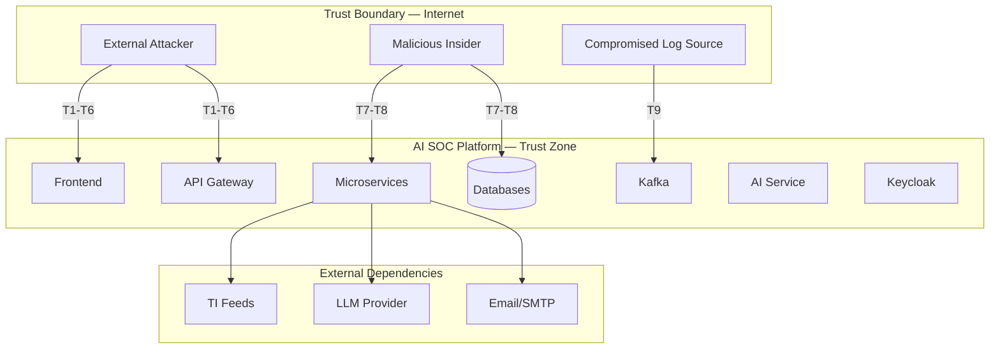
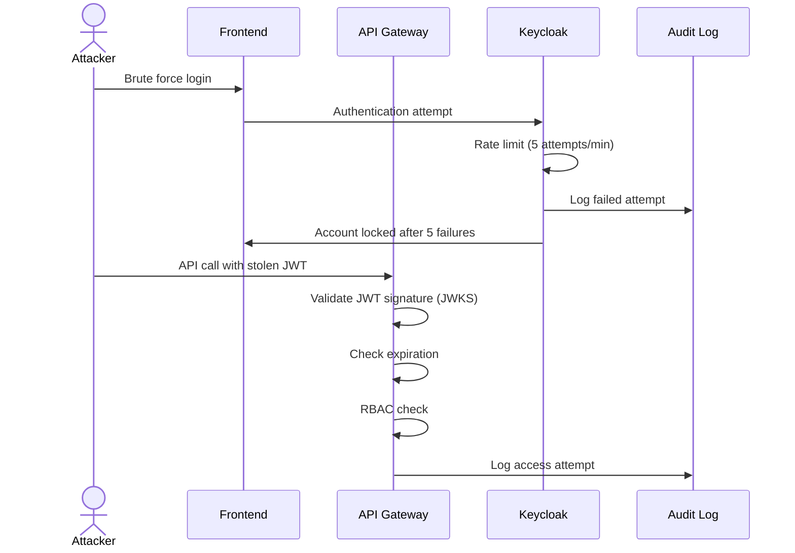
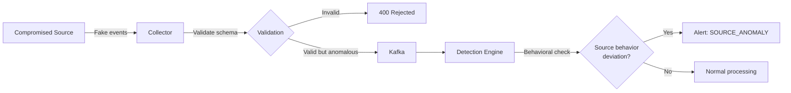
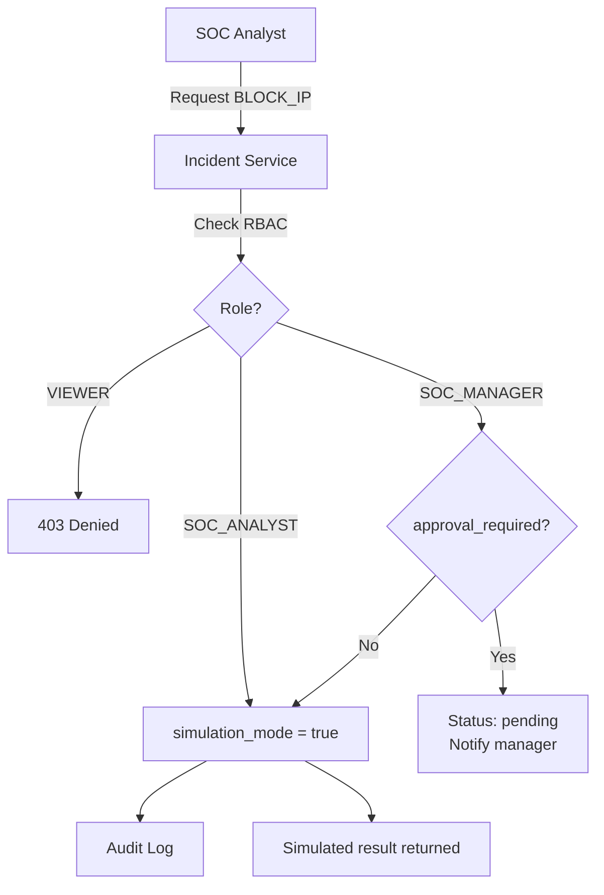

# Threat Model — AI SOC Platform

> Méthodologie : **STRIDE** + **OWASP Top 10** + **MITRE ATT&CK for ICS/SaaS**

## 1. Scope

---

## 2. Assets critiques

| Asset | Classification | Impact si compromis |
|-------|---------------|---------------------|
| JWT / Session tokens | Critical | Accès non autorisé au SOC |
| Security events & alerts | High | Perte de visibilité, fausses données |
| Incident data | High | Fuite d'informations sensibles |
| IOC / Threat Intelligence | High | Décisions de blocage incorrectes |
| Detection rules | High | Bypass de détection |
| AI model & knowledge base | Medium | Réponses incorrectes, hallucinations |
| Audit logs | Critical | Perte de traçabilité (compliance) |
| SOAR response actions | Critical | Actions destructives non autorisées |
| Database credentials | Critical | Accès total aux données |
| LLM API keys | Medium | Abus de quota, coût |

---

## 3. STRIDE Analysis

### Spoofing (Usurpation d'identité)

| ID | Menace | Vector | Impact | Mitigation |
|----|--------|--------|--------|------------|
| S1 | Usurpation d'un analyste SOC | Vol de JWT/session | High | MFA obligatoire, JWT short-lived (15min), refresh token rotation |
| S2 | Usurpation de log source | POST /events sans auth | High | API key + mTLS pour collectors, IP allowlist |
| S3 | Usurpation inter-services | Appels internes non authentifiés | High | mTLS entre services (prod), service mesh |
| S4 | Fake TI feed | Injection de faux IOC | Medium | Validation des feeds, signature checking, source reputation |

### Tampering (Altération)

| ID | Menace | Vector | Impact | Mitigation |
|----|--------|--------|--------|------------|
| T1 | Modification d'events en transit | Kafka message tampering | High | TLS + SASL_SSL, message signing (future) |
| T2 | Modification de detection rules | API non autorisée | Critical | RBAC strict (SOC_MANAGER+), audit log |
| T3 | Modification d'incidents | API avec privilèges insuffisants | High | RBAC, optimistic locking, audit trail |
| T4 | Modification d'audit logs | Direct DB access | Critical | Append-only table, separate DB user (INSERT only), immutable storage |
| T5 | Prompt injection sur AI | Input malveillant via chat | Medium | Input sanitization, system prompt isolation, output validation |

### Repudiation (Déni)

| ID | Menace | Vector | Impact | Mitigation |
|----|--------|--------|--------|------------|
| R1 | Analyste nie une action SOAR | Pas de trace | High | Audit log immuable avec user_id, IP, timestamp |
| R2 | Admin nie un changement de config | Pas de versioning | Medium | Config versioning, audit log, GitOps |
| R3 | Négation d'accès au dashboard | Session non tracée | Low | Session logging, Keycloak event logs |

### Information Disclosure (Divulgation)

| ID | Menace | Vector | Impact | Mitigation |
|----|--------|--------|--------|------------|
| I1 | Fuite de données via API | IDOR, broken access control | Critical | RBAC, resource-level authorization, OWASP A01 |
| I2 | Fuite via logs/métriques | PII dans les logs | Medium | Log sanitization, pas de passwords/tokens dans logs |
| I3 | Fuite via AI responses | LLM expose des données internes | Medium | RAG scope limiting, PII anonymization |
| I4 | Fuite via OpenSearch | Requêtes non filtrées | High | Tenant isolation, query-level RBAC |
| I5 | Secrets dans Git | Commit accidentel | Critical | Gitleaks CI, .gitignore, pre-commit hooks |
| I6 | Error messages verbeux | Stack traces en prod | Low | Generic error messages, structured logging |

### Denial of Service (Déni de service)

| ID | Menace | Vector | Impact | Mitigation |
|----|--------|--------|--------|------------|
| D1 | Event flooding | POST /events massif | High | Rate limiting (Redis), payload size limits, auto-scaling |
| D2 | Kafka topic saturation | Producer malveillant | High | Quotas Kafka, backpressure, DLQ |
| D3 | AI service abuse | Requêtes LLM massives | Medium | Rate limiting, token budget, queue |
| D4 | OpenSearch overload | Requêtes complexes | Medium | Query timeout, circuit breaker, index lifecycle |
| D5 | WebSocket connection exhaustion | Connexions massives | Medium | Connection limits, heartbeat timeout |

### Elevation of Privilege (Élévation de privilèges)

| ID | Menace | Vector | Impact | Mitigation |
|----|--------|--------|--------|------------|
| E1 | VIEWER → SOC_ANALYST | JWT claim manipulation | Critical | Server-side RBAC validation, Keycloak as source of truth |
| E2 | SOC_ANALYST → ADMIN | API bypass | Critical | Middleware RBAC sur chaque endpoint, least privilege |
| E3 | Exécution SOAR réelle (non simulée) | Bypass simulation_mode | Critical | simulation_mode=true par défaut, approval workflow, RBAC |
| E4 | Container escape | Vulnérabilité K8s | Critical | Non-root containers, read-only FS, NetworkPolicies, Trivy scan |

---

## 4. OWASP Top 10 Mapping

| OWASP 2021 | Applicabilité | Mitigation dans AI SOC |
|------------|---------------|------------------------|
| **A01 Broken Access Control** | Critical | RBAC Keycloak, middleware auth, resource-level checks |
| **A02 Cryptographic Failures** | High | TLS 1.3, bcrypt/argon2, encrypted at rest (RDS) |
| **A03 Injection** | High | Pydantic validation, parameterized SQL (SQLAlchemy), OpenSearch query builder |
| **A04 Insecure Design** | High | Threat modeling (ce document), SOAR simulation by default |
| **A05 Security Misconfiguration** | High | Helm values, Terraform, security scanning CI |
| **A06 Vulnerable Components** | High | Dependabot, Trivy, pip-audit, npm audit |
| **A07 Auth Failures** | Critical | Keycloak, MFA, JWT rotation, session management |
| **A08 Data Integrity Failures** | Medium | Kafka message validation, schema versioning |
| **A09 Logging Failures** | High | Structured logging, audit trail, Prometheus alerts |
| **A10 SSRF** | Medium | URL validation for TI feeds, allowlist outbound |

---

## 5. Attack Scenarios

### Scenario 1 : Attaquant externe tente d'accéder au dashboard

**Mitigations** : MFA, rate limiting, JWT expiration courte, account lockout, audit logging.

### Scenario 2 : Log source compromise — injection d'events falsifiés

**Mitigations** : API key auth, source registration, behavioral baseline per source, rate limiting per source.

### Scenario 3 : Analyste malveillant tente une action SOAR destructive

**Mitigations** : simulation_mode=true par défaut, approval workflow, RBAC, audit immuable.

---

## 6. Security Controls Matrix

| Control | Layer | Implementation | Phase |
|---------|-------|----------------|-------|
| Authentication | Identity | Keycloak OAuth2/OIDC | Phase 3 |
| MFA | Identity | Keycloak TOTP | Phase 3 |
| Authorization (RBAC) | Application | FastAPI middleware + Keycloak roles | Phase 3 |
| Input Validation | Application | Pydantic models | Phase 4+ |
| Rate Limiting | Application | Redis sliding window | Phase 2 |
| TLS | Transport | ALB/Ingress TLS 1.3 | Phase 2 |
| mTLS (inter-service) | Transport | Service mesh / cert-manager | Phase 22 |
| Encryption at rest | Data | RDS encryption, OpenSearch encryption | Phase 2/23 |
| Secrets management | Data | AWS Secrets Manager / K8s Secrets | Phase 2 |
| Audit logging | Application | Append-only PostgreSQL | Phase 3 |
| Network isolation | Network | K8s NetworkPolicies | Phase 22 |
| Container security | Infrastructure | Non-root, read-only FS, Trivy | Phase 21 |
| SAST | CI/CD | Semgrep | Phase 21 |
| DAST | CI/CD | OWASP ZAP | Phase 21 |
| Secret scanning | CI/CD | Gitleaks | Phase 21 |
| Dependency scanning | CI/CD | Trivy, pip-audit | Phase 21 |
| SOAR simulation | Application | simulation_mode default | Phase 18 |

---

## 7. Security Requirements Checklist

- [ ] Tous les endpoints API authentifiés (sauf /health, /metrics)
- [ ] RBAC vérifié côté serveur pour chaque opération
- [ ] MFA activé pour ADMIN et SOC_MANAGER
- [ ] JWT expiration ≤ 15 minutes, refresh token rotation
- [ ] Pas de secrets dans le code source ou Git
- [ ] Audit log pour toutes les actions sensibles
- [ ] Rate limiting sur tous les endpoints publics
- [ ] Input validation Pydantic sur tous les inputs
- [ ] SOAR actions en mode simulation par défaut
- [ ] CORS configuré strictement (frontend origin only)
- [ ] Security headers (HSTS, CSP, X-Frame-Options, etc.)
- [ ] Container images scannées (Trivy) dans CI
- [ ] Dependencies scannées (Semgrep, pip-audit)
- [ ] Secrets scannés (Gitleaks) dans CI
- [ ] Logs structurés sans PII/secrets
- [ ] NetworkPolicies K8s restrictives
- [ ] Encryption at rest pour toutes les databases
